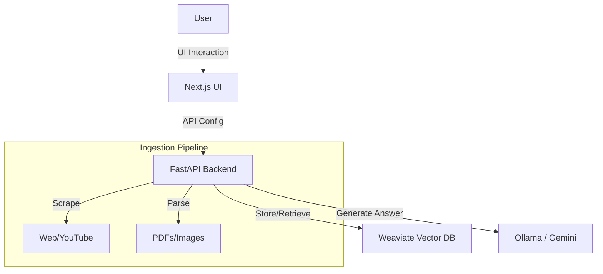

# 🧠 MeshMemory
> **Your Second Brain. Powered by Graph RAG.**

  

MeshMemory is an intelligent knowledge management system that doesn't just store your notes—it **understands** them. By combining **Vector Search** (RAG) with a **Semantic Knowledge Graph**, it visualizes connections between your ideas that you didn't even know existed.

✨ **Live Demo**: [https://meshmemory.onrender.com](https://meshmemory.onrender.com)

---

## 🚀 Key Features

### 🕸️ Semantic Knowledge Graph
Visualize your brain. Every memory is a node. Connections are created automatically based on meaning, not just tags.

### ⚡ Neural Input
Ingest anything.
- **Notes**: Quick thoughts & ideas.
- **Files**: Drag & drop PDFs, Images, Audio (processed by Gemini 2.5).
- **Web**: Scrape articles or YouTube videos with one click.

### 🧠 Graph RAG (Retrieval Augmented Generation)
Chat with your data. The AI assistant retrieves relevant memories + their connected neighbors to provide deep, context-aware answers.

### 🔒 Deployment Freedom
- **Local Mode (Privacy)**: Run 100% offline with Docker + Ollama.
- **Cloud Mode (Convenience)**: Deploy to the cloud for access anywhere.

---

## 🛠️ Quick Start

You can run MeshMemory in two modes. See **[CONFIG.md](./CONFIG.md)** for the detailed setup guide.

### Mode A: Online Endpoint (Easiest)
*Connects your local UI to our deployed cloud backend.*

```bash
cd ui
npm install
npm run dev
```
*That's it! Open http://localhost:3000.*

### Mode B: Local Power User (Private)
*Runs the full stack (LLM + Vector DB) on your machine.*

1. **Start Docker** (Weaviate).
2. **Start Backend** (FastAPI).
3. **Start Frontend** (Next.js).

👉 **[Read the Full Setup Guide](./CONFIG.md)**

---

## 🏗️ Technical Architecture

MeshMemory is built on a modern, scalable stack:

- **Frontend**: Next.js 14, TailwindCSS, Framer Motion, React Force Graph.
- **Backend**: Python FastAPI, BeautifulSoup, PyPDF.
- **AI / Core**:
    - **LLM**: Gemini 2.5 Flash (Multimodal) OR Ollama (Local Llama 3).
    - **Vector DB**: Weaviate (Hybrid Search enabled).
    - **Embeddings**: `all-MiniLM-L6-v2` (Local) or Weaviate-managed.



---

## 🤝 Contributing
Contributions are welcome! Please verify that your changes pass the lint check (`npm run lint` in UI) before pushing.

## 📄 License
MIT License. © 2024 Pranav Patil.
