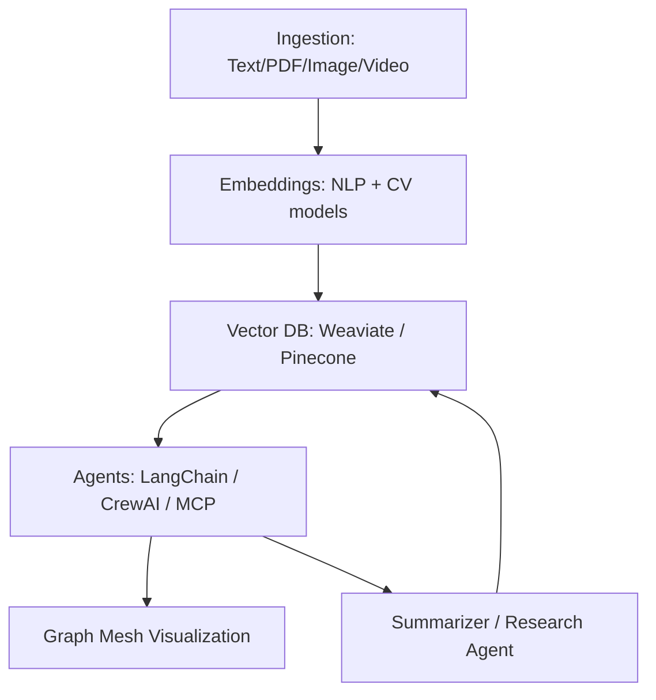

# 🧠 MeshMemory 2.0  
**Your AI-powered second brain — multi-modal, agentic, research-ready.**

 
 
 

---

## 🌟 Overview
MeshMemory 2.0 is a re-imagined **AI-first personal knowledge mesh**.  
It ingests information from diverse sources — notes, PDFs, images, videos — and builds a **living memory graph** with retrieval, summarization, visualization, and agentic reasoning.  

This project demonstrates skills across **AI, ML, DL, NLP, CV, VectorDBs, LLM Agentic Frameworks (LangChain, CrewAI, MCP), Reinforcement Learning, and end-to-end ML pipelines**.  

🚀 **Goal**: A demo-able, research-worthy system you can showcase as portfolio + production.  

---

## ✨ Features
- 📝 **Multi-modal ingestion**: Notes, PDFs, YouTube, lecture slides, whiteboard images.  
- 🔍 **Semantic embeddings**: HuggingFace, OpenAI, CLIP.  
- 🗃️ **Vector storage**: Weaviate (local, research) or Pinecone (cloud, scalable).  
- 🤖 **Agentic recall**: LangChain + CrewAI + MCP for orchestrated reasoning.  
- 🕸️ **Mesh visualization**: Interactive graph view of concept nodes.  
- 🧠 **Memory consolidation**: Summarize + compress embeddings over time.  
- 🎓 **Research spin**: RL feedback loop for retrieval optimization.  

---

## 📐 Architecture

---

## 🛠️ Tech Stack

* **Frontend**: Next.js + Tailwind (deploy: Vercel)
* **Backend**: FastAPI (Python for ML/NLP ops)
* **Vector DB**: Weaviate / Pinecone
* **ML/NLP**: HuggingFace, OpenAI, SentenceTransformers, CLIP
* **Agents**: LangChain, CrewAI, MCP (Model Context Protocol)
* **Visualization**: Vis.js / Excalidraw
* **Extras**: OCR (Tesseract), RLHF-inspired feedback

---

## 📊 Roadmap

* [x] Initial repo setup
* [ ] MVP: Text/PDF ingestion → embeddings → vector DB → retrieval
* [ ] Graph-based visualization of memory mesh
* [ ] Add multi-modal ingestion (YouTube, images, OCR)
* [ ] Agentic workflows with MCP orchestration
* [ ] RL feedback loop for relevance optimization
* [ ] Deploy demo to Vercel

---

## 🎓 Research Opportunities

* **Memory consolidation**: Neural compression of old embeddings.
* **Multi-modal mesh**: Unifying text + vision knowledge.
* **RL-driven retrieval**: Learning from user feedback.
* **MCP**: Exploring standard context-passing between agents.

---

## 🖼️ Demo

> *(Coming soon)*
> Add screenshots / GIFs of:

* Uploading notes → seeing mesh build.
* Querying memory → agent recalls linked concepts.
* Graph visualization demo.

---

## 🤝 Contributing

PRs, issues, and ideas are welcome!

---

## 📜 License

MIT License © 2025 Pranav Patil

---

## 🙌 Acknowledgments

* [LangChain](https://www.langchain.com/)
* [CrewAI](https://www.crewai.com/)
* [Weaviate](https://weaviate.io/)
* [Pinecone](https://www.pinecone.io/)
* [MCP](https://modelcontextprotocol.io/)

---

